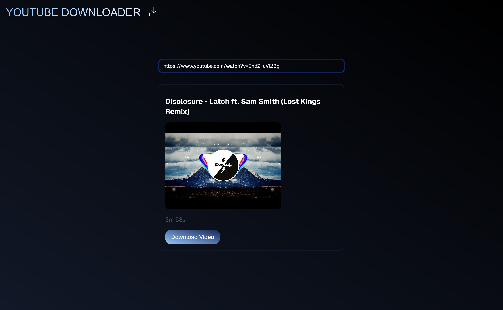

# YouTube Downloader Website

This project is a YouTube downloader website that allows users to download YouTube videos. The application consists of a frontend built with Next.js and a backend built with FastAPI. The project is containerized using Docker and managed with Docker Compose.

<!-- Showcase image -->



## Features

- Download YouTube videos by providing a URL.
- Automatically delete the oldest downloaded video if the number of downloaded videos exceeds a limit.
- Frontend built with Next.js.
- Backend built with FastAPI.
- Containerized with Docker and managed with Docker Compose.

## Prerequisites

- Node v22.11.0
- pnpm v9.15.2
- Python v3.12
- Docker v27.4.0

## Project Structure

```plaintext
youtube-downloader-website/
├── backend/
│   ├── main.py
│   ├── Dockerfile.backend
│   ├── requirements.txt
├── frontend/
│   ├── app/
│   ├── components/
│   ├── Dockerfile.frontend
│   ├── pages/
│   ├── .env
├── docker-compose.yml
├── README.md
```

## Getting Started

### Clone the Repository

```bash
git clone https://github.com/StenerNordnes/youtube-downloader-website.git
cd youtube-downloader-website
```

### Set Environment Variables

Create a `.env` file in the `frontend` directory and add the following environment variables:

```plaintext
NEXT_PUBLIC_API_URL=http://localhost:8000
```

### Build and Run the Application

1. Build the Docker images:

   ```bash
   docker-compose build
   ```

2. Run the Docker containers:

   ```bash
   docker-compose up
   ```

### Run development environment

1. Run the frontend:

   ```bash
   cd frontend
   pnpm install
   pnpm run dev
   ```

2. Run the backend:

   ```bash
   cd backend
   pip install -r requirements.txt
   uvicorn main:app --reload
   ```

### Access the Application

- Frontend: [http://localhost:3000](http://localhost:3000)
- Backend: [http://localhost:8000](http://localhost:8000)

## Backend

The backend is built with FastAPI and consists of a single endpoint that downloads YouTube videos. The downloaded videos are stored in the `downloads` directory.

#### Endpoints

- `POST /api/download`: Downloads a YouTube video to the server.

  **Request:**

  ```json
  {
    "url": "https://www.youtube.com/watch?v=video_id"
  }
  ```

  **Response:**

  ```json
  {
    "title": "string",
    "duration": "string",
    "thumbnail": "string",
    "download_link": "string"
  }
  ```

- `GET /api/video/{video_name}`: Serves the downloaded video.

  **Response:**
  The video file.

## License

This project is open source and available under the [MIT License](LICENSE).
